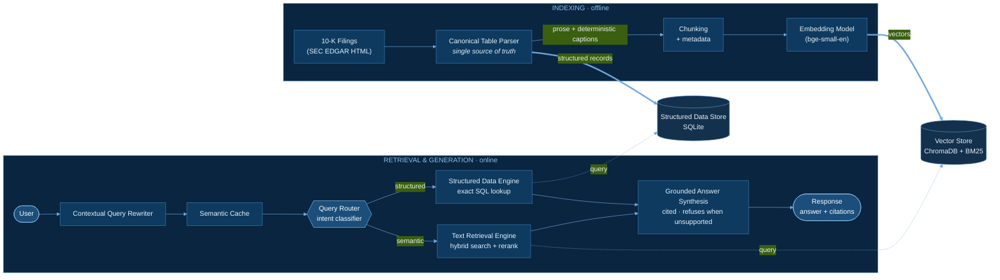

```mermaid
%%{init: {'theme':'base','themeVariables':{'background':'#0A2540','primaryColor':'#0E3A5F','primaryBorderColor':'#3F7CB0','primaryTextColor':'#EAF2FB','lineColor':'#6FA8DC','fontFamily':'Arial, Helvetica, sans-serif','clusterBkg':'#0A2540','clusterBorder':'#3F7CB0'}}}%%
flowchart LR
    subgraph IDX["INDEXING · offline"]
        direction LR
        DOC["10-K Filings<br/>(SEC EDGAR HTML)"] --> CP["Canonical Table Parser<br/><i>single source of truth</i>"]
        CP -->|prose + deterministic captions| CH["Chunking<br/>+ metadata"]
        CH --> EM["Embedding Model<br/>(bge-small-en)"]
    end

    CP ==>|structured records| SQL[("Structured Data Store<br/>SQLite")]
    EM ==>|vectors| VDB[("Vector Store<br/>ChromaDB + BM25")]

    subgraph RUN["RETRIEVAL & GENERATION · online"]
        direction LR
        U(["User"]) --> QR["Contextual Query Rewriter"]
        QR --> SC["Semantic Cache"]
        SC --> RT{{"Query Router<br/>intent classifier"}}
        RT -->|structured| SDE["Structured Data Engine<br/>exact SQL lookup"]
        RT -->|semantic| TRE["Text Retrieval Engine<br/>hybrid search + rerank"]
        SDE --> GEN["Grounded Answer Synthesis<br/>cited · refuses when unsupported"]
        TRE --> GEN
        GEN --> RESP(["Response<br/>answer + citations"])
    end

    SDE -. query .-> SQL
    TRE -. query .-> VDB

    classDef box fill:#0E3A5F,stroke:#3F7CB0,color:#EAF2FB,stroke-width:1px;
    classDef store fill:#13314C,stroke:#5B93C7,color:#EAF2FB,stroke-width:1px;
    classDef accent fill:#1B4E7A,stroke:#8Fc1EA,color:#FFFFFF,stroke-width:1px;
    class DOC,CP,CH,EM,QR,SC,SDE,TRE,GEN box;
    class SQL,VDB store;
    class RT,RESP,U accent;
```

