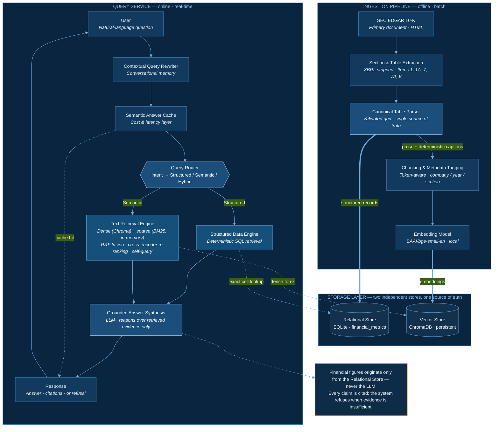

```mermaid
%%{init: {'theme':'base','themeVariables':{'background':'#0A2540','primaryColor':'#123A5E','primaryBorderColor':'#3F7CB0','primaryTextColor':'#EAF2FB','lineColor':'#6FA8DC','fontFamily':'Helvetica, Arial, sans-serif','clusterBkg':'#0A2540','clusterBorder':'#3F7CB0','fontSize':'13px'}}}%%
flowchart TB
    subgraph ING["INGESTION PIPELINE — offline · batch"]
        direction LR
        SRC["SEC EDGAR 10-K<br/><i>Primary document · HTML</i>"]
        EXT["Section &amp; Table Extraction<br/><i>XBRL stripped · Items 1, 1A, 7, 7A, 8</i>"]
        PARSE["Canonical Table Parser<br/><i>Validated grid · single source of truth</i>"]
        CHUNK["Chunking &amp; Metadata Tagging<br/><i>Token-aware · company / year / section</i>"]
        EMB["Embedding Model<br/><i>BAAI/bge-small-en · local</i>"]
        SRC --> EXT --> PARSE
        PARSE -->|"prose + deterministic captions"| CHUNK --> EMB
    end

    subgraph STORE["STORAGE LAYER — two independent stores, one source of truth"]
        direction LR
        SQL[("Relational Store<br/>SQLite · financial_metrics")]
        VDB[("Vector Store<br/>ChromaDB · persistent")]
    end

    subgraph SVC["QUERY SERVICE — online · real-time"]
        direction LR
        USR["User<br/><i>Natural-language question</i>"]
        RW["Contextual Query Rewriter<br/><i>Conversational memory</i>"]
        CACHE["Semantic Answer Cache<br/><i>Cost &amp; latency layer</i>"]
        ROUTER{{"Query Router<br/>intent → Structured / Semantic / Hybrid"}}
        SDE["Structured Data Engine<br/><i>Deterministic SQL retrieval</i>"]
        TRE["Text Retrieval Engine<br/><i>Dense (Chroma) + sparse (BM25, in-memory)<br/>RRF fusion · cross-encoder re-ranking · self-query</i>"]
        SYN["Grounded Answer Synthesis<br/><i>LLM · reasons over retrieved evidence only</i>"]
        RESP["Response<br/><i>Answer · citations · or refusal</i>"]
        USR --> RW --> CACHE --> ROUTER
        ROUTER -->|"Structured"| SDE
        ROUTER -->|"Semantic"| TRE
        SDE --> SYN
        TRE --> SYN
        SYN --> RESP --> USR
        CACHE -.->|"cache hit"| RESP
    end

    PARSE ==>|"structured records"| SQL
    EMB ==>|"embeddings"| VDB
    SDE -.->|"exact cell lookup"| SQL
    TRE -.->|"dense top-k"| VDB

    NOTE["Financial figures originate only from the Relational Store — never the LLM.<br/>Every claim is cited; the system refuses when evidence is insufficient."]
    SYN -.-> NOTE

    classDef box fill:#123A5E,stroke:#3F7CB0,color:#EAF2FB,stroke-width:1px;
    classDef engine fill:#14507A,stroke:#5B93C7,color:#FFFFFF,stroke-width:1px;
    classDef accent fill:#1B4E7A,stroke:#8FC1EA,color:#FFFFFF,stroke-width:1px;
    classDef store fill:#13314C,stroke:#5B93C7,color:#EAF2FB,stroke-width:1px;
    classDef note fill:#0E2C47,stroke:#E0A93B,color:#EAF2FB,stroke-width:1px;

    class SRC,EXT,CHUNK,EMB,USR,RW,CACHE,RESP box;
    class SDE,TRE engine;
    class PARSE,ROUTER,SYN accent;
    class SQL,VDB store;
    class NOTE note;
```
