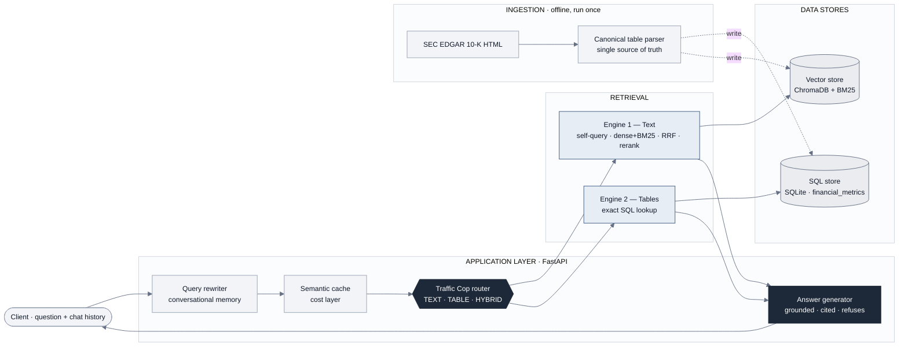

```mermaid
%%{init: {'theme':'base','themeVariables':{'fontFamily':'Arial, Helvetica, sans-serif','lineColor':'#667085','clusterBkg':'#FBFCFD','clusterBorder':'#D0D5DD','fontSize':'13px'}}}%%
flowchart LR
    U(["Client · question + chat history"])

    subgraph APP["APPLICATION LAYER · FastAPI"]
        direction TB
        RW["Query rewriter<br/><span>conversational memory</span>"]
        CACHE["Semantic cache<br/><span>cost layer</span>"]
        ROUTER{{"Traffic Cop router<br/>TEXT · TABLE · HYBRID"}}
        GEN["Answer generator<br/><span>grounded · cited · refuses</span>"]
        RW --> CACHE --> ROUTER
    end

    subgraph RET["RETRIEVAL"]
        direction TB
        E1["Engine 1 — Text<br/><span>self-query · dense+BM25 · RRF · rerank</span>"]
        E2["Engine 2 — Tables<br/><span>exact SQL lookup</span>"]
    end

    subgraph DATA["DATA STORES"]
        direction TB
        VEC[("Vector store<br/>ChromaDB + BM25")]
        SQL[("SQL store<br/>SQLite · financial_metrics")]
    end

    subgraph ING["INGESTION · offline, run once"]
        direction TB
        SRC["SEC EDGAR 10-K HTML"] --> PARSE["Canonical table parser<br/><span>single source of truth</span>"]
    end

    U --> RW
    ROUTER --> E1 & E2
    E1 --> VEC
    E2 --> SQL
    E1 --> GEN
    E2 --> GEN
    GEN --> U
    PARSE -.->|write| SQL
    PARSE -.->|write| VEC

    classDef default fill:#F2F4F7,stroke:#98A2B3,color:#101828,stroke-width:1px;
    classDef store fill:#EAECF0,stroke:#667085,color:#101828;
    classDef accent fill:#1D2939,stroke:#1D2939,color:#FFFFFF;
    classDef engine fill:#E7EDF5,stroke:#3E5C82,color:#101828;
    class VEC,SQL store;
    class ROUTER,GEN accent;
    class E1,E2 engine;
```
