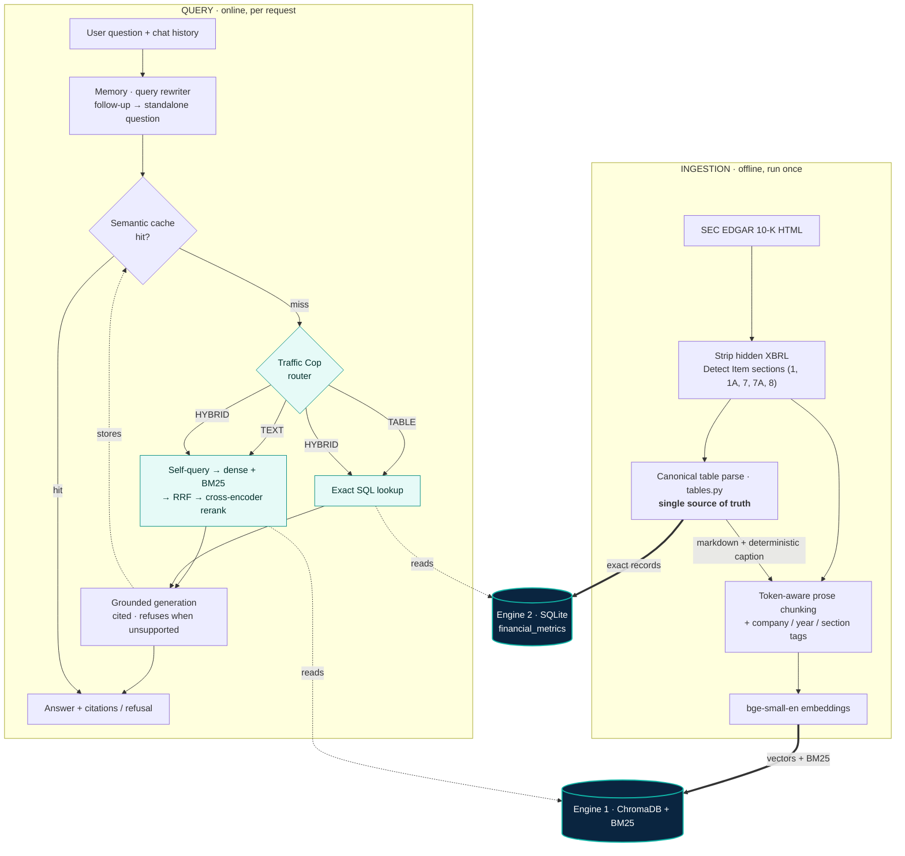

```mermaid
flowchart TB
    subgraph OFFLINE["INGESTION · offline, run once"]
        direction TB
        RAW["SEC EDGAR 10-K HTML"] --> CLEAN["Strip hidden XBRL<br/>Detect Item sections (1, 1A, 7, 7A, 8)"]
        CLEAN --> PARSE["Canonical table parse · tables.py<br/><b>single source of truth</b>"]
        CLEAN --> CHUNK["Token-aware prose chunking<br/>+ company / year / section tags"]
        PARSE -->|"markdown + deterministic caption"| CHUNK
        CHUNK --> EMB["bge-small-en embeddings"]
    end

    PARSE ==>|"exact records"| DB[("Engine 2 · SQLite<br/>financial_metrics")]
    EMB  ==>|"vectors + BM25"| VEC[("Engine 1 · ChromaDB + BM25")]

    subgraph ONLINE["QUERY · online, per request"]
        direction TB
        Q["User question + chat history"] --> RW["Memory · query rewriter<br/>follow-up → standalone question"]
        RW --> CACHE{"Semantic cache<br/>hit?"}
        CACHE -->|"miss"| COP{"Traffic Cop<br/>router"}
        COP -->|"TABLE"| L2["Exact SQL lookup"]
        COP -->|"TEXT"| L1["Self-query → dense + BM25<br/>→ RRF → cross-encoder rerank"]
        COP -->|"HYBRID"| L2
        COP -->|"HYBRID"| L1
        L1 --> GEN["Grounded generation<br/>cited · refuses when unsupported"]
        L2 --> GEN
        GEN --> ANS["Answer + citations / refusal"]
    end

    L2 -. reads .-> DB
    L1 -. reads .-> VEC
    CACHE -->|"hit"| ANS
    GEN -. stores .-> CACHE

    classDef store fill:#0A2540,stroke:#0FB5A6,color:#ffffff,stroke-width:2px;
    classDef eng   fill:#E6FAF7,stroke:#0C8F84,color:#04302c;
    class DB,VEC store;
    class L1,L2,COP eng;
```
